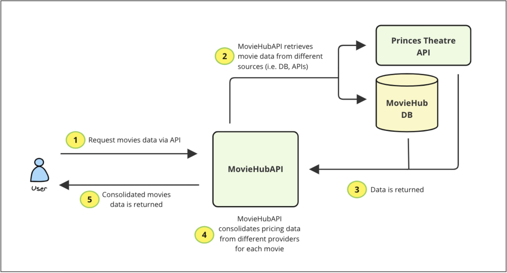
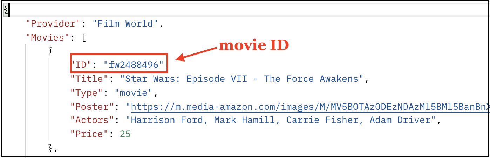
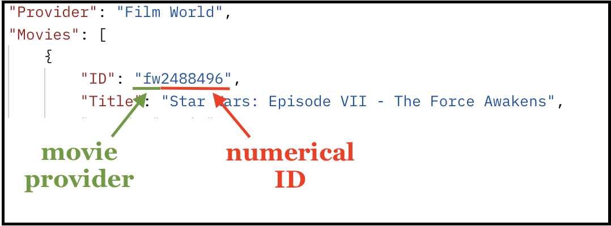
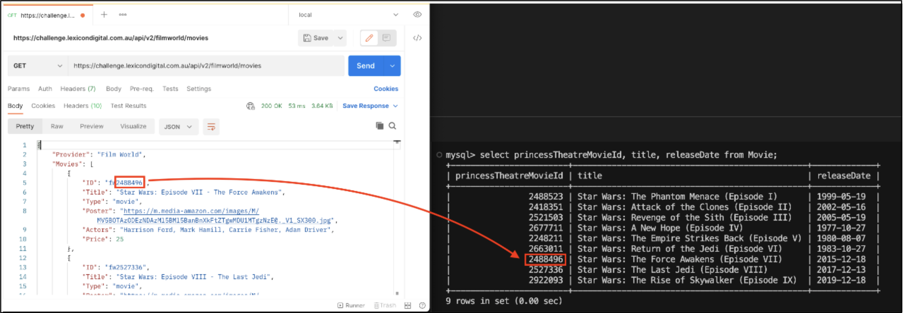

# Task #3: New Feature - Cinema Integration ⚡️

MovieHub has now requested to integrate with the **Princess Theatre API** which contains information about two different cinemas, Filmworld and Cinemaworld, and would like their ticket prices to also be returned in the Movie Details response data.
The Princess Theatre API is strange however, because they only provide a route that returns a list of movies for each cinema. You will have to extract the specific movies from its payload, and match them with the existing movies in MovieHub.



## Feature Requirements ✅

* __Integrate Princess Theatre Movie Prices__
  * Include in the existing __Movie Details__ endpoint, the ticket prices for Filmworld and Cinemaworld.

## Princess Theatre API Details 👩🏻‍💻

#### List of movies

```
  GET https://challenge.lexicondigital.com.au/api/v2/{movie-provider}/movies
```

| Header    | Type     | Value |  Description                |
| :-------- | :------- | :---- |  :------------------------- |
| `api_key` | `string` | `Yr2636E6BTD3UCdleMkf7UEdqKnd9n361TQL9An7` |  **Required**. API to authenticate. |

| Parameter | Type     | Value |  Description                |
| :-------- | :------- | :---- |  :------------------------- |
| `{movie-provider}` | `string` | `filmworld` or `cinemaworld` |  Indicates the movie provider to pull movies for. |

Example
```
  GET https://challenge.lexicondigital.com.au/api/v2/cinemaworld/movies
  GET https://challenge.lexicondigital.com.au/api/v2/filmworld/movies
```

## Matching Prince Theatre API and moviehub DB movies 🧩
As mentioned above, the Princes Theatre API endpoint retrieves information about the movies by movie provider. An example as follows:



More specifically, the ID is returned in the format **`{Character}{Character}{NumericReference}`** (i.e. fw2488496). The first two letters represent the **movie provider** (**`fw`** for **filmworld** and **`cw`** for **cinemaworld**) and the number represents the **numerical ID** of the movie (i.e. 2488496).



Moreover, the table **`Movie`** in the **`moviehub`** database contains the field **`princessTheatreMovieId`**. This field holds the **numerical ID** of each movie within the **Princess Theater API**. In other words:



Based on the above, movies should be matched by correlating the **numerical ID** from the **Princess Theatre API** with the value stored in the **`princessTheatreMovieId`** field of the **`moviehub`** database.
