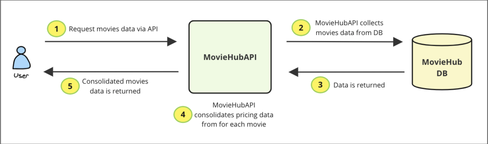
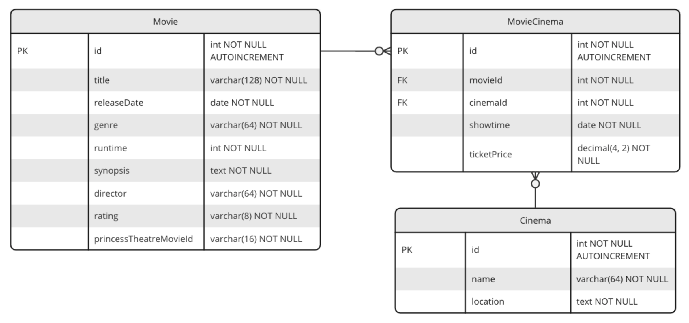

# Task #1: Initial Feature - MovieHub API Implementation

## Objective 🎯
Develop a [.NET](https://dotnet.microsoft.com/en-us/learn/dotnet/what-is-dotnet) application using [Entity Framework](https://learn.microsoft.com/en-us/ef/), with a [SQLite](https://www.sqlite.org/) database to provide users with detailed information about movies, including showtimes, cinemas, and ticket prices. The focus is writing a backend implementation to meet MovieHub's needs.

## Feature Requirements ✅
Build an API endpoint with routes to meet the following feature requirements:

* __List of Movies__
  * Display a list of movies, with a search feature that allows users to search for movies by title or genre.

* __Movie Details__
  * Display detailed information about each movie, including title, release date, genre, runtime, synopsis, director, cast, and rating.
  * Show cinemas where the movies are being played with their ticket price and their showtimes

## Database 🗄

It is expected to implement the data model using [SQLite](https://www.sqlite.org/) as database and [Entity Framework](https://learn.microsoft.com/en-us/ef/). Find the database diagram as follows:

Once the database is in place, the script [moviehub-db-data-seed.sql](db/moviehub-db-data-seed.sql) can be used to **INSERT** the data required.

> **_NOTE:_**  _Please implement the database using the exact standard found in the diagram above (table name **PascalCase** and attributes **camelCase**). Otherwise the [moviehub-db-data-seed.sql script](db/moviehub-db-data-seed.sql) might not work properly_.

## Hints/Guide 💡

1. Create classes to represent the tables shown in the ER diagram.
2. Generate the migration files, and run them to create the tables for your SQLite database.
3. Run the provided code to populate your database with data.
4. Create the API routes to meet the desired requirements.
5. Provide an OpenAPI Spec (swagger) for the endpoints implemented.
6. Write integration tests to confirm your API routes function as intended.

## Out of scope ❌
1. No hosting is required. We will clone your codebase and run it locally. Then we can verify the API functionality through the Swagger page that is generated automatically through Entity Framework
2. No frontend is required
3. No authentication is required
4. You do not need to populate the database with your movies, cinemas, etc. We have provided a file you can run that will populate the database
