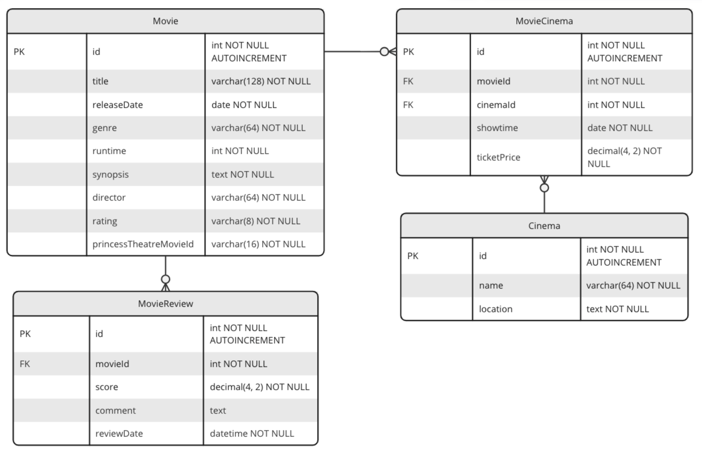

# Task #2: New Feature - Reviewing Movies ⭐⭐⭐

MovieHub has recently proposed the integration of a new feature that enables users to contribute feedback regarding their experience with movies, encompassing various aspects such as assigning scores, sharing comments, and offering additional insights.

## Feature Requirements ✅
Build an API endpoint with routes to meet the following feature requirements:

* __List of Reviews by Movie__
  * Display a list reviews including score, comments and date for a given movie.

* __Create a Review__
  * Endpoint that enables the creation of a review.

* __Update a Review__
  * Endpoint that enables the modification of a review.

* __Delete a Review__
  * Endpoint that enables removal of a review.

* __Average Score in Movies__
  * Include in the existing __List of Movies__ and __Movie Details__ endpoints the average score of movies.

## Database 🗄

The database model has been extended in order to include a table for the movies reviews (table **`MovieReview`**). More details as follows:

> **_NOTE:_**  _As suggested for the previous task, please follow the same standard as the data model above (table name **PascalCase** and attributes **camelCase**)_.
